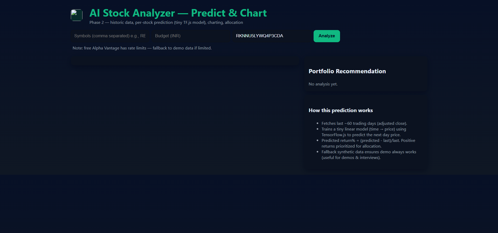
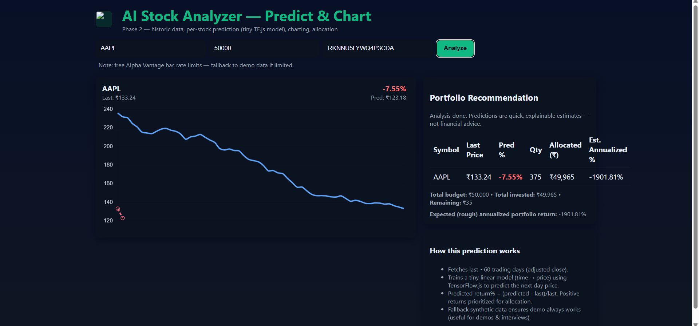

<!DOCTYPE html>
<html lang="en">
<head>
  <meta charset="UTF-8" />
  <meta name="viewport" content="width=device-width, initial-scale=1" />
  <title>Stock Market Analyzer - README</title>
  
</head>
<body>
  <h1>📈 Stock Market Analyzer</h1>
  
A web-based tool that helps users analyze stock market trends and make informed investment decisions based on their budget and selected companies.

  
  

    <h2>🚀 Features</h2>
    <ul>
      <li>🔍 Real-time market data using the Alpha Vantage API</li>
      <li>💰 Budget-based profit/loss prediction</li>
      <li>🏢 Company-specific analysis</li>
      <li>📊 Clean and intuitive interface for quick insights</li>
    </ul>
  

  
  

    <h2>🛠️ Technologies Used</h2>
    <ul>
      <li>HTML, CSS, JavaScript</li>
      <li>Alpha Vantage API</li>
      <li>[Any frameworks or libraries you used—feel free to add here]</li>
    </ul>
  

  
  

    <h2>📦 Installation</h2>
    
Clone the repository:

    <pre><code>git clone https://github.com/your-username/stock-market-analyzer.git</code></pre>
    
Navigate to the project folder:

    <pre><code>cd stock-market-analyzer</code></pre>
    
Open <code>index.html</code> in your browser.

  

  
  

    <h2>🔑 API Key Setup</h2>
    <ol>
      <li>Sign up at <a href="https://www.alphavantage.co" target="_blank" rel="noopener noreferrer">Alpha Vantage</a> to get your free API key.</li>
      <li>Replace <code>YOUR_API_KEY</code> in the code with your actual key.</li>
    </ol>
  

  
  

    <h2>📸 Screenshots</h2>
    
    
  

  
  

    <h2>📄 License</h2>
    
This project is licensed under the MIT License.

  

</body>
</html>
